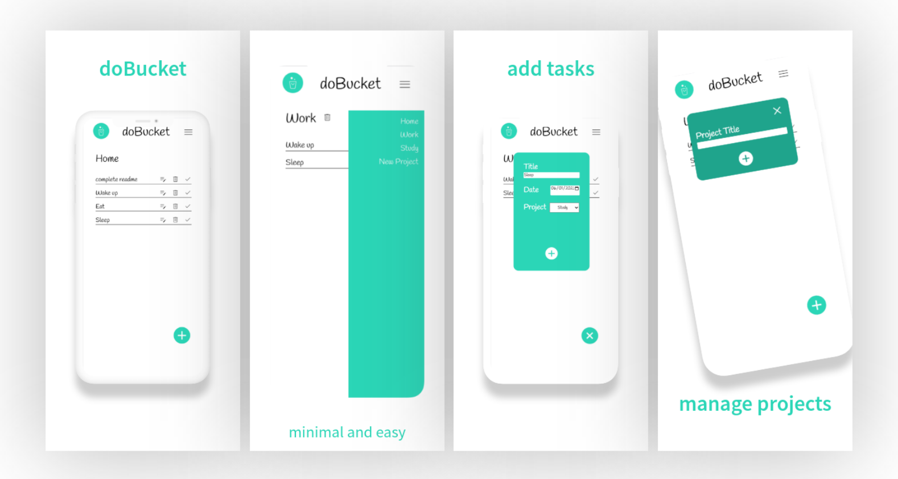
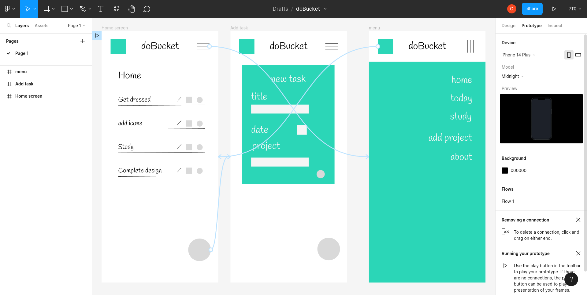
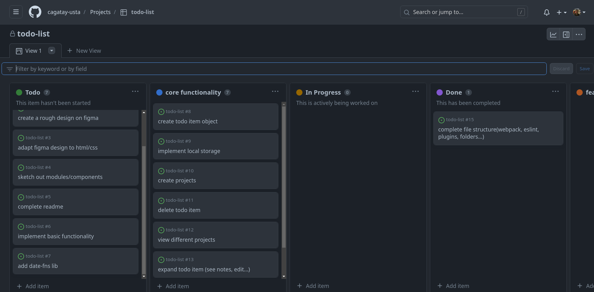

# Description

doBucket is a task management web application that helps you stay organized and motivated to complete your tasks on time. It has a unique twist - tasks are automatically deleted on their due date, providing an extra incentive to complete them before time runs out. With doBucket, you can effectively manage your tasks and ensure that nothing falls through the cracks. It was built as a homework project from The Odin Project, using HTML, CSS, JavaScript, and Webpack as technologies, and used airbnb style guide with ESLint.

Check out the live [preview here](https://cagatay-usta.github.io/todo-list/)

 

# Features

- Add, edit, and remove tasks
- Task categorization
- User-friendly interface
- Responsive design for both desktop and mobile devices
- Automatic task deletion on due date (Soon)

 

 

# Installation

You can use it directly online, hosted on Github Pages [here.](https://cagatay-usta.github.io/todo-list/)
 
If you rather want to check the source code and modify it:

1. Clone the repository to your local machine using git clone.
2. Navigate to the project directory in your terminal.
3. Install the dependencies using npm install or yarn install.
4. Start the development server using npm run dev or yarn dev.
5. Open your web browser and go to http://localhost:3000 to access the app.

 

# Tech Stack

- 

- 

- 

- 

- 

 

# Story Behind the Build

I experienced from my previous projects that having a rough plan at hand before writing a single line of code really helps with complexity and refactoring. However, I also realized that I might have spent a bit too much time on designing visuals before so I went for a rough sketch for this one.

Also doing the project while reading "Refactoring UI" have been a very fun and informative experience and I tried to incorporate the advice on it such as "start with a feauture first" into my design.

First protype on Figma:

I also went with the same planning and structure mindset for the code. In this project, I utilized the GitHub Projects tool for effective project management and streamlined task tracking. This allowed me to stay organized, prioritize tasks, and collaborate more efficiently.

Here is a screenshot from my very first issues:
You can also see how it's going now by [clicking here.](https://github.com/users/cagatay-usta/projects/2/views/1)

Furthermore, I embraced modern JavaScript practices by leveraging ES6 modules. The use of modules enhanced the modularity of the codebase and facilitated better code organization. Additionally, I integrated ESLint into my development process to ensure code consistency and adhere to best practices. These tools and practices collectively contributed to the overall quality of the codebase.

While there is always room for improvement, the lessons learned from previous projects, along with the adoption of GitHub Projects, Figma for prototyping, ES6 modules, and ESLint, have laid the foundation for a more structured and efficient development process.

# Contributing

Contributions to doBucket app are welcome, although not needed as I developed this as a learning project :) If you find any issues or have suggestions for improvements, please feel free to open an issue or submit a pull request. All feedback is appreciated.

# License

doBucket is open-source software released under the [MIT License.](/LICENSE)

# Contact

If you have any feedback, comments, or inquiries, please feel free to contact me. I would be happy to connect with you!

- Email: cagatay_usta@windowslive.com
- GitHub: [cagatay-usta](https://github.com/cagatay-usta)
- LinkedIn: [Cagatay Usta](https://www.linkedin.com/in/cagatay-usta/)

Thank you for checking out my repo!
